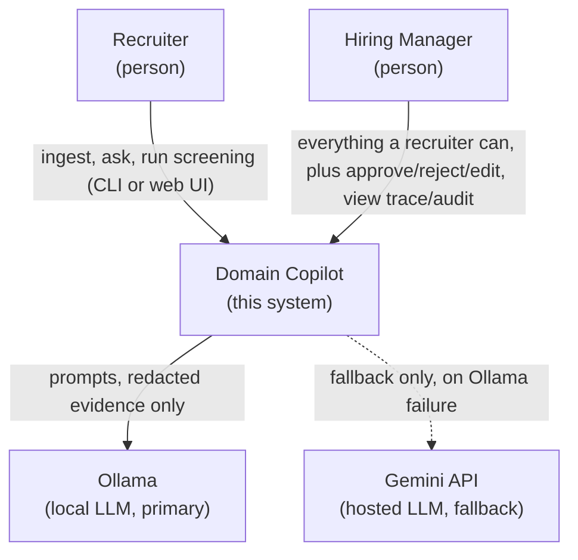
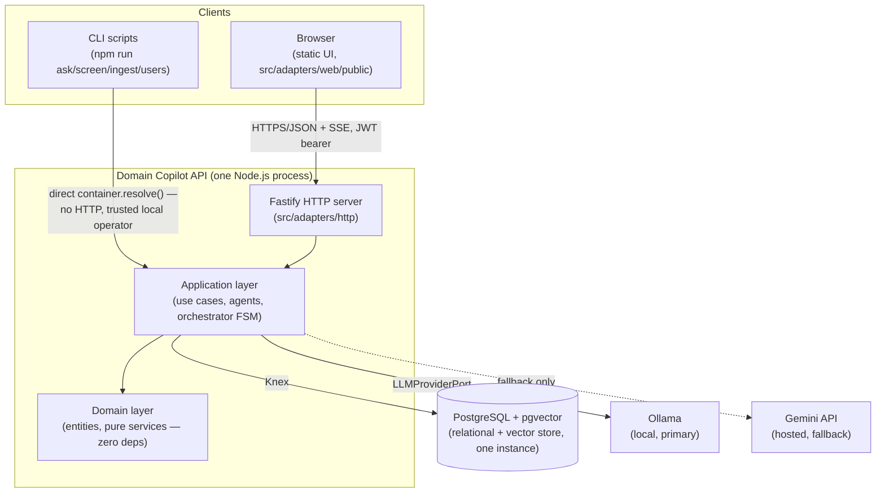
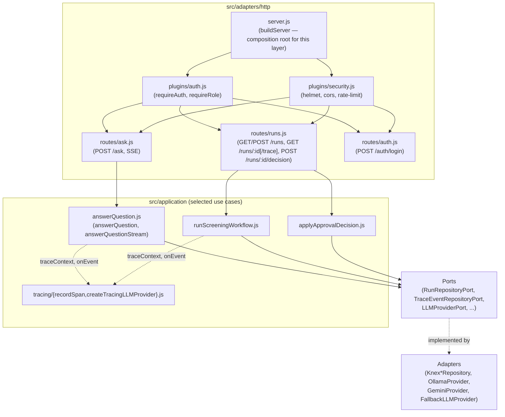
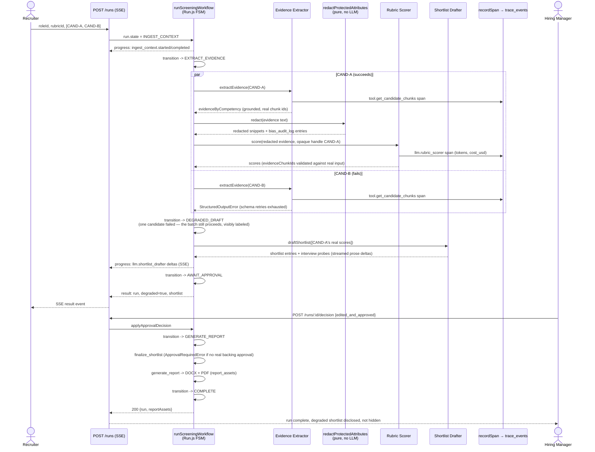
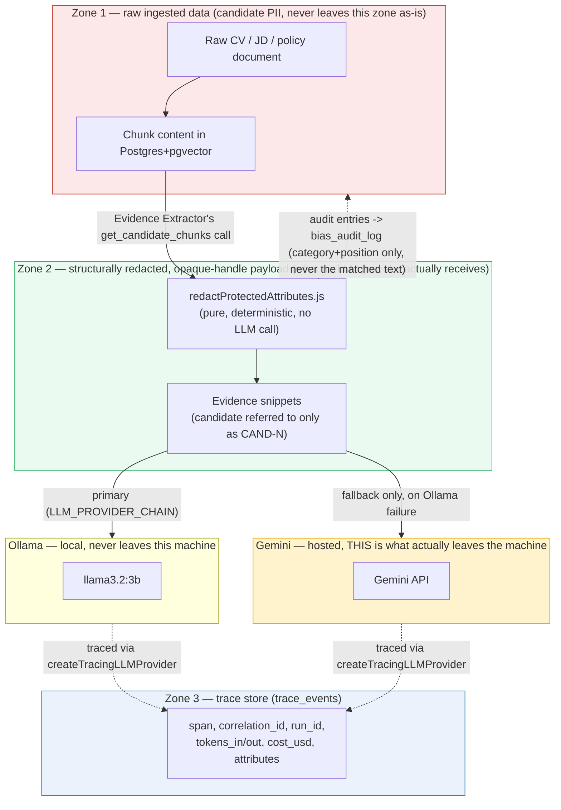
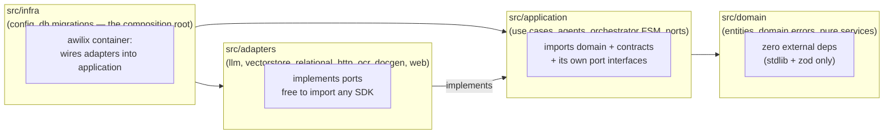

# Architecture — Domain Copilot (D6 + T6)

> Status: living document. Diagrams are Mermaid, rendered inline in this file — the source is the file itself, so there is nothing separate to keep in sync. Each diagram below is filled in as the phase it depicts is implemented; a diagram is not drawn ahead of the code it describes.

## Architectural style

**Hexagonal (Ports & Adapters)**. Justification: the assessment's acceptance test is "swapping the LLM provider, embedding model, or vector store requires configuration plus one adapter — not changes to business logic." That test is exactly what a port/adapter boundary is for: `src/domain` and `src/application` depend only on interfaces defined in `src/application/ports`; every concrete implementation lives in `src/adapters` and is selected at the `src/infra` composition root via `awilix` + environment configuration.

Alternatives considered: layered/N-tier (rejected — doesn't name an explicit seam for provider-swapping, tends to leak infrastructure concerns upward informally); Vertical Slice (rejected — this system's slices share a single linear domain workflow and a shared provider/retrieval core, so slicing by feature would duplicate the port boundary rather than clarify it).

## C4 Level 1 — System Context

## C4 Level 2 — Containers

## C4 Level 3 — Components

Scoped to the HTTP container (Level 2's `api` box) — the piece that changed most this phase.

## Sequence diagram — full agentic workflow (incl. approval gate and streaming)

Two candidates shown (`CAND-A` scores cleanly, `CAND-B` fails extraction) so the `DEGRADED_DRAFT` branch — the most distinctive thing about this orchestrator (ADR-0002) — is visible rather than asserted. `Run.js`'s real transition table (`src/domain/entities/Run.js`) is what's drawn here, not a simplified retelling of it.

## Data-flow diagram — trust boundaries & what the LLM provider sees

Landed in Phase 7 (delayed from its original Phase 6 slot — better timing anyway, since `trace_events` is one of the three zones and didn't exist until this phase decided what it actually persists).

**What crosses each boundary, and what doesn't:**
- Zone 1 → Zone 2: only after `redactProtectedAttributes.js` runs — a pure function, no network access, so this boundary cannot be prompted around (ADR-0006). A candidate's real name never crosses it at all; `RubricScorerInputSchema` has no field capable of carrying one.
- Zone 2 → Ollama: stays on the local machine — the default, primary path (`LLM_PROVIDER_CHAIN=ollama,gemini`).
- Zone 2 → Gemini: only on Ollama failure/timeout (`FallbackLLMProvider`) — this is the one path where redacted evidence text leaves the local machine, called out explicitly here rather than left implicit in the provider abstraction.
- Zone 2/Ollama/Gemini → Zone 3 (`trace_events`): every LLM call is traced (`createTracingLLMProvider`, Phase 7 PR1) — real token counts (Ollama's `prompt_eval_count`/`eval_count`, Gemini's `usageMetadata`), `cost_usd` genuinely 0 for both configured providers (no invented price table). Trace attributes never include the evidence text itself, only span/timing/token metadata — the trace store is an observability record, not a second copy of Zone 2's payload.
- Zone 3 → Zone 1 (dashed): `bias_audit_log` records *that* a redaction happened (category, position) but deliberately never the matched text itself, so the audit trail can't become a second copy of the PII it's proving was removed (docs/SECURITY.md).

## ER diagram

Generated from the real migrations (`src/infra/db/migrations/`), not from a remembered table list — includes tables that landed after this diagram was originally scoped (`users`, Phase 6; `report_assets`, Phase 5; `trace_events`, Phase 7; `scores.evidence_snippets`, Phase 6).

```mermaid
erDiagram
    CANDIDATES ||--o{ DOCUMENTS : "owns (nullable — non-CV docs have none)"
    CANDIDATES ||--o{ CHUNKS : "owns (nullable, denormalized for retrieval filtering)"
    DOCUMENTS ||--o{ CHUNKS : "chunked into"
    RUNS ||--o{ RUN_STEPS : "history"
    RUNS ||--o{ APPROVALS : "decided by"
    RUNS ||--o{ SCORES : "produces"
    RUNS ||--o| SHORTLISTS : "drafts (one per run)"
    RUNS ||--o{ BIAS_AUDIT_LOG : "redaction trail"
    RUNS ||--o{ REPORT_ASSETS : "generates"
    RUNS ||--o{ TRACE_EVENTS : "traces (nullable — a run-less /ask call still traces)"
    APPROVALS ||--o| SHORTLISTS : "authorizes finalization of"
    APPROVALS ||--o{ REPORT_ASSETS : "authorizes generation of"

    CANDIDATES {
        text id PK
        text handle UK "opaque CAND-N, never a name"
        text full_name
        text created_by
    }
    DOCUMENTS {
        text id PK
        text type "job_description|competency_framework|rubric|cv|policy|process_guide"
        text status "pending|processing|indexed|needs_ocr|failed"
        text candidate_id FK "nullable"
        text content_hash "drives idempotent re-ingestion"
        boolean ocr_required
    }
    CHUNKS {
        text id PK
        text document_id FK
        text candidate_id FK "nullable, denormalized"
        text document_type "denormalized from documents.type"
        vector embedding "768-dim, HNSW index"
        tsvector content_tsv "generated column, GIN index"
        decimal ocr_confidence "nullable"
        text chunker_version
    }
    COMPETENCIES {
        text id PK
        text name
        jsonb behavioral_anchors "levels 1-5"
    }
    RUBRICS {
        text id PK
        text role_id "not a FK — plain text join key"
        jsonb competency_weights "[{competencyId, weight}] — not a junction table, see migration comment"
    }
    RUNS {
        text id PK
        text workflow_type
        text state "11-value CHECK, mirrors Run.js's FSM"
        text created_by "ownership scoping (FR-8), ADR-0002"
    }
    RUN_STEPS {
        text id PK
        text run_id FK
        text state
        text note "nullable — a DEGRADED_DRAFT reason or FAILED error"
    }
    APPROVALS {
        text id PK
        text run_id FK
        text decision "approved|rejected|edited_and_approved"
        jsonb edit_diff "nullable"
    }
    SCORES {
        text id PK
        text run_id FK
        text candidate_handle "opaque CAND-N — NOT a candidates.id join, by design (ADR-0006)"
        text competency_id "not a FK — plain text join key"
        decimal value
        jsonb evidence_chunk_ids
        jsonb evidence_snippets "nullable — [{sourceChunkId, text}], Phase 6"
    }
    SHORTLISTS {
        text id PK
        text run_id FK "unique — one per run"
        jsonb entries "[{candidateHandle, rank, summary, interviewProbes}]"
        boolean degraded
        text approval_id FK "nullable until finalized"
        timestamp finalized_at "nullable"
    }
    BIAS_AUDIT_LOG {
        text id PK
        text run_id FK
        text category "one of the closed PROTECTED_ATTRIBUTE_CATEGORIES list"
        text action "redact|drop"
        integer span_start "nullable for drop"
        integer span_end "nullable for drop"
    }
    REPORT_ASSETS {
        text id PK
        text run_id FK
        text approval_id FK "not nullable — cannot exist without one"
        text format "docx|pdf"
        binary content
    }
    USERS {
        text id PK
        text email UK
        text password_hash
        text role "recruiter|hiring_manager"
    }
    TRACE_EVENTS {
        text id PK
        text correlation_id "= run_id for a screening run; fresh id for a run-less /ask"
        text run_id FK "nullable"
        text span "e.g. llm.rubric_scorer, tool.get_candidate_chunks"
        integer tokens_in "nullable"
        integer tokens_out "nullable"
        decimal cost_usd "nullable — genuinely 0 for both configured providers"
    }
```

**Deliberate non-normalization, twice, for the same reason:** `rubrics.competency_weights` and `shortlists.entries` are both `jsonb` rather than junction tables — an expedient choice documented in their own migrations, correct at this project's scale (a handful of rubrics/shortlist entries, never queried by weight or entry independently of their parent row). `Rubric.js`'s own invariant (weights sum to 1) guards the data's integrity, not a DB constraint — a real, disclosed tradeoff, not an oversight.

**Two deliberately-missing foreign keys, both by design, not by accident:** `scores.candidate_handle` is plain text, never a join to `candidates.id` — the Rubric Scorer only ever produces an opaque handle, and a real FK here would make it trivially easy to accidentally join scores back to a candidate's name elsewhere in the codebase, undermining the whole point of ADR-0006's opaque-handle design. `rubrics.role_id` and `scores.competency_id` are also plain text, not FKs to a `roles`/`competencies` table by id — `competencies.id` *is* a real primary key, but nothing in the schema forces a `scores.competency_id` to reference one; this is validated at the application layer (`RubricScorerOutputSchema`'s per-call `.refine()`) instead, which is a real, disclosed weaker guarantee than a DB constraint would be.

## Layer-dependency diagram

Arrows point inward, toward `domain` — the direction a dependency is *allowed* to run, not the direction data flows at request time (a request flows outward-to-inward: `infra` builds the server, `adapters/http` receives it, calls into `application`, which calls `domain`). `infra` is the only layer permitted to import `adapters` and wire it into `application` (the composition root, per `CLAUDE.md`'s non-negotiable rule).

**This is enforced, not just documented.** `eslint.config.js` carries two `no-restricted-imports` rules, checked on every commit (`lint-staged`/Husky) and every CI run: files under `src/domain/**` may not import from `**/adapters/**`, `**/infra/**`, or a concrete SDK (`fastify`, `knex`, `pg`, `ollama`, `@google/*`) directly; files under `src/application/**` may not import from `**/adapters/**` at all — only the port interfaces `src/application/ports` defines itself. A PR that violates either rule fails `npm run lint` before it reaches review, not after.

## Architecture Decision Records

| ADR | Title | Status |
|---|---|---|
| [ADR-0001](adr/0001-chunking-and-retrieval-strategy.md) | Chunking and retrieval strategy | Accepted |
| [ADR-0002](adr/0002-orchestration-pattern.md) | Orchestration pattern | Accepted |
| [ADR-0003](adr/0003-vector-store-choice.md) | Vector store choice | Accepted |
| [ADR-0004](adr/0004-document-in-out-twist.md) | T6 twist: OCR and document generation approach | Accepted |
| [ADR-0005](adr/0005-provider-abstraction-and-structured-output.md) | Provider abstraction and structured-output strategy | Accepted |
| [ADR-0006](adr/0006-bias-safety-design.md) | Bias-safety design (D6's named risk) | Accepted |
| [ADR-0007](adr/0007-streaming-strategy.md) | Streaming strategy — SSE, prose vs. discrete progress events | Accepted |
