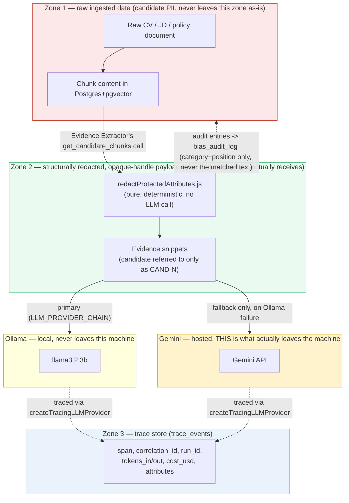

# Architecture — Domain Copilot (D6 + T6)

> Status: living document. Diagrams are Mermaid, rendered inline in this file — the source is the file itself, so there is nothing separate to keep in sync. Each diagram below is filled in as the phase it depicts is implemented; a diagram is not drawn ahead of the code it describes.

## Architectural style

**Hexagonal (Ports & Adapters)**. Justification: the assessment's acceptance test is "swapping the LLM provider, embedding model, or vector store requires configuration plus one adapter — not changes to business logic." That test is exactly what a port/adapter boundary is for: `src/domain` and `src/application` depend only on interfaces defined in `src/application/ports`; every concrete implementation lives in `src/adapters` and is selected at the `src/infra` composition root via `awilix` + environment configuration.

Alternatives considered: layered/N-tier (rejected — doesn't name an explicit seam for provider-swapping, tends to leak infrastructure concerns upward informally); Vertical Slice (rejected — this system's slices share a single linear domain workflow and a shared provider/retrieval core, so slicing by feature would duplicate the port boundary rather than clarify it).

## C4 Level 1 — System Context

_TODO (Phase 7)._

## C4 Level 2 — Containers

_TODO (Phase 7)._

## C4 Level 3 — Components

_TODO (Phase 7)._

## Sequence diagram — full agentic workflow (incl. approval gate and streaming)

_TODO (Phase 9, once Phases 4-7 land): request → orchestrator FSM transitions → Evidence Extractor → redaction stage → Rubric Scorer → Shortlist Drafter (streamed) → AWAIT_APPROVAL → hiring-manager decision → GENERATE_REPORT (DOCX + PDF) → COMPLETE, with the DEGRADED_DRAFT branch shown explicitly._

## Data-flow diagram — trust boundaries & what the LLM provider sees

Landed in Phase 7 (delayed from its original Phase 6 slot — better timing anyway, since `trace_events` is one of the three zones and didn't exist until this phase decided what it actually persists).

**What crosses each boundary, and what doesn't:**
- Zone 1 → Zone 2: only after `redactProtectedAttributes.js` runs — a pure function, no network access, so this boundary cannot be prompted around (ADR-0006). A candidate's real name never crosses it at all; `RubricScorerInputSchema` has no field capable of carrying one.
- Zone 2 → Ollama: stays on the local machine — the default, primary path (`LLM_PROVIDER_CHAIN=ollama,gemini`).
- Zone 2 → Gemini: only on Ollama failure/timeout (`FallbackLLMProvider`) — this is the one path where redacted evidence text leaves the local machine, called out explicitly here rather than left implicit in the provider abstraction.
- Zone 2/Ollama/Gemini → Zone 3 (`trace_events`): every LLM call is traced (`createTracingLLMProvider`, Phase 7 PR1) — real token counts (Ollama's `prompt_eval_count`/`eval_count`, Gemini's `usageMetadata`), `cost_usd` genuinely 0 for both configured providers (no invented price table). Trace attributes never include the evidence text itself, only span/timing/token metadata — the trace store is an observability record, not a second copy of Zone 2's payload.
- Zone 3 → Zone 1 (dashed): `bias_audit_log` records *that* a redaction happened (category, position) but deliberately never the matched text itself, so the audit trail can't become a second copy of the PII it's proving was removed (docs/SECURITY.md).

## ER diagram

_TODO (Phase 2-4, as the schema solidifies): documents, chunks, candidates, competencies, rubrics, evidence, scores, runs, run_steps, approvals, bias_audit_log, trace_events._

## Layer-dependency diagram

_TODO (Phase 1): domain ← application ← adapters ← infra, with the rule "arrows only point inward" made explicit and checked by an ESLint import-boundary rule._

## Architecture Decision Records

| ADR | Title | Status |
|---|---|---|
| [ADR-0001](adr/0001-chunking-and-retrieval-strategy.md) | Chunking and retrieval strategy | Proposed |
| [ADR-0002](adr/0002-orchestration-pattern.md) | Orchestration pattern | Accepted |
| [ADR-0003](adr/0003-vector-store-choice.md) | Vector store choice | Accepted |
| [ADR-0004](adr/0004-document-in-out-twist.md) | T6 twist: OCR and document generation approach | Accepted |
| [ADR-0005](adr/0005-provider-abstraction-and-structured-output.md) | Provider abstraction and structured-output strategy | Accepted |
| [ADR-0006](adr/0006-bias-safety-design.md) | Bias-safety design (D6's named risk) | Proposed |
| [ADR-0007](adr/0007-streaming-strategy.md) | Streaming strategy — SSE, prose vs. discrete progress events | Proposed |
